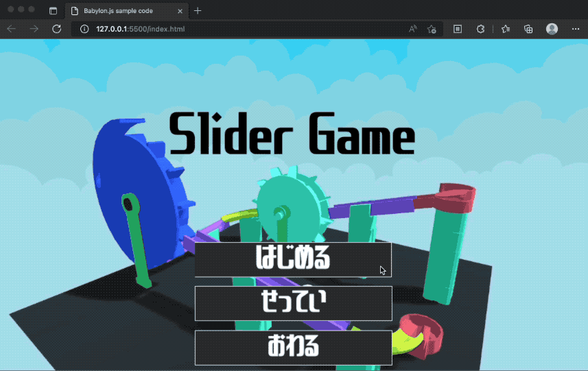

# A GUI example generated from GUI Editor of Babylon.js
The repo shows an example GUI layout created by GUI Editor of Babylon.js. 
Babylon.js kindly provides a helpful GUI creating tool as "GUI Editor" since v5.  
It is still beta version but we can create such a sample game title screen.  

  

The code shows a title and a setting screen. 

# Environment

- Babylon.js 5.0 or later  
- [GUI Editor provided by Babylon.js v5 or later](https://gui.babylonjs.com/)  

# How to use

1. Install the following font on your computer.  

font name : きんいろサンセリフ  
http://getsuren.com/kiniro_series.html  

You can execute the sample without the font, but the apperarnce is different.  

2. Execute it on server and access via Web browsers.  

Any method is OK. I recommend Visual Studio code and Live server plugin.  
https://marketplace.visualstudio.com/items?itemName=ritwickdey.LiveServer  

